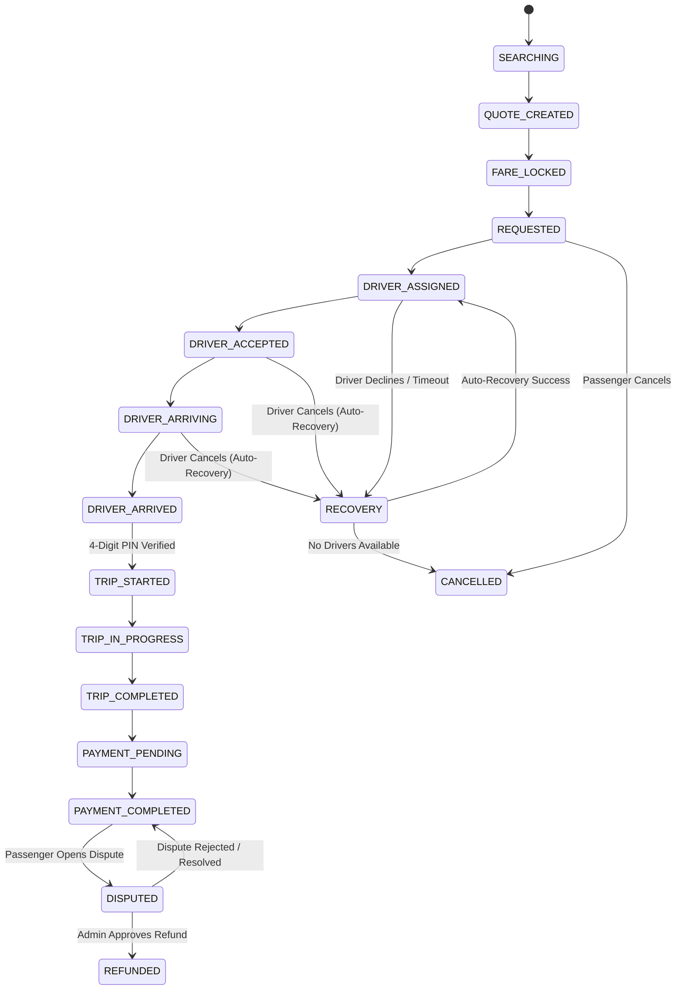

# FairRide Platform Architecture

> **Tagline:** "Book With Confidence."

FairRide is a trust-first, safety-focused, transparent, and intelligent mobility platform engineered to systematically eliminate the 25 most frequent failure modes of legacy ride-hailing services.

---

## 1. High-Level Architecture Overview

FairRide employs a clean, modular monorepo architecture separating the user presentation layer, domain logic, core API services, and AI microservices:

```
fairride/
│
├── apps/
│   ├── web/           # React 18 + Vite + Tailwind CSS + Zustand (Mobile-First PWA)
│   ├── api/           # Node.js + Express + TypeScript + Socket.IO + Mongoose
│   └── ai-service/    # Python 3.12 + FastAPI + Scikit-Learn (Mobility Intelligence)
│
├── packages/
│   ├── types/         # Domain TypeScript interfaces (Roles, States, Schemas)
│   ├── constants/     # Vehicle configs, pricing rules, i18n dictionaries
│   ├── validation/    # Zod schemas for input validation
│   └── shared/        # Shared algorithms (Haversine, Fare, Net-Earnings, PIN)
│
├── docs/              # In-depth architectural, API, DB, AI, and security specs
├── docker-compose.yml # Containerized multi-service deployment
└── README.md
```

---

## 2. The Four Primary Role Workspaces

1. **Passenger Portal**:
   - Location discovery with **Smart Pickup Point Coordination** (Gates, Metro exits, Airport terminals).
   - **Upfront Fare Lock System**: Guaranteed pricing with itemized breakdown.
   - **Auto-Recovery Engine**: In the event of driver cancellation, the platform automatically re-pairs the next candidate without restarting the search or penalizing the rider.
   - **Route Guardian Watchdog**: Real-time corridor deviation monitoring with passenger check-in prompt ("I'M SAFE", "NEED HELP", "EMERGENCY SOS").
   - **Post-Trip Fare Audit**: Downloadable and printable verifiable tax receipt.

2. **Driver Portal**:
   - **Transparent Net Take-Home Calculator**: Previews passenger fare, platform fee, estimated fuel cost, tolls, and net profit *before* acceptance.
   - **Boarding PIN Verification**: Prevents unauthorized passenger pickups.
   - **AI Demand Heatmap**: High, Medium, and Low demand hubs to guide positioning without fuel-wasting blind cruising.
   - **Driver Wallet**: Transparent ledger with instant bank settlement.

3. **Admin & Operations Control Center**:
   - **Live Operations Fleet Map**: Real-time GPS markers of available, busy, and offline drivers.
   - **Safety Operations Console**: Triage queue for SOS triggers and route detours with call routing, incident notes, and resolution workflows.
   - **Evidence-Based Dispute Resolution**: Auto-assembled evidence bundles (FareLock record, final fare, GPS timeline, driver actions) with 1-click refund authorization.
   - **Anti-Cancellation & Fraud AI Watchdog**: Pattern detection for drivers demanding extra cash or suspicious multi-account collusion.
   - **Pricing Engine**: Dynamic base fare, km rate, and tax configuration with immutable audit logs.

4. **Corporate Organization Portal**:
   - Company profiles, monthly travel budgets, and cost-center allocations.
   - Travel policy rules (e.g. max fare per ride, allowed vehicle tiers).
   - Employee directory and **Manager Ride Approval Queue**.
   - Consolidated monthly GST tax invoices and CSV exports.

---

## 3. Core Booking State Machine

FairRide enforces a strict, tamper-evident finite state machine for every ride:



---

## 4. Breakthrough Innovations Explained

### Innovation 1: Fare Lock System
- **Problem Solved**: Unclear fares, unexpected post-trip surge spikes, and hidden charges.
- **Implementation**: When a quote is generated, a `FareLock` document is committed with an exact breakdown: Base Fare + Distance Charge + Time Component + Toll + Platform Fee + GST. This total cannot be modified by the driver. Any variable modification (such as an unanticipated toll bridge) produces an itemized `FareAudit` receipt.

### Innovation 2: Auto-Recovery Engine
- **Problem Solved**: Driver accepting and later cancelling, forcing the passenger to start over at higher surge rates.
- **Implementation**: When an assigned driver cancels, the booking state transitions to `RECOVERY`. The dispatch engine immediately searches candidate drivers within a 15km radius, prioritizing reliability and ETA, and auto-assigns the new driver without re-charging or charging cancellation fees.

### Innovation 3: Driver Net Earnings Transparency
- **Problem Solved**: Drivers demanding offline cash due to uncertainty about take-home earnings.
- **Implementation**: The incoming ride request explicitly computes:
  $$\text{Net Earnings} = \text{Passenger Fare} - \text{Platform Fee (10\%)} - \text{Est. Fuel Cost (₹6.5/km)} - \text{Tolls}$$
  Clearly labeled as estimates, this eliminates driver compensation misunderstandings.

### Innovation 4: Route Guardian Live GPS Watchdog
- **Problem Solved**: Unmonitored route deviations and passenger safety anxiety.
- **Implementation**: During a trip, real-time GPS coordinates are cross-checked against a 300-meter corridor tolerance. If a sustained detour occurs, the app prompts the passenger with check-in options ("I'M SAFE", "NEED HELP", "EMERGENCY SOS") and alerts the Safety Operations Console.

### Innovation 5: Evidence-Based Dispute Resolution
- **Problem Solved**: Arbitrary dispute resolutions lacking objective facts.
- **Implementation**: When a dispute is filed, FairRide automatically bundles the upfront FareLock, the final fare, GPS track point counts, and immutable timeline events into a single verified packet for admin review.
