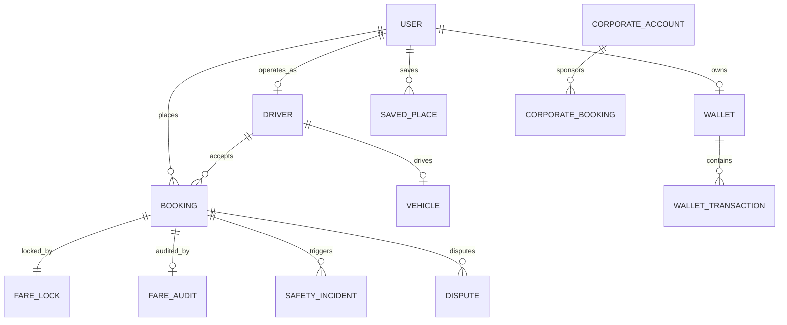

# FairRide Database Architecture

FairRide uses MongoDB with Mongoose ODM, leveraging `2dsphere` geospatial indexing, compound indexes, and an immutable-style append-only ledger pattern.

---

## 1. Entity Relationship Overview

---

## 2. Core Collections & Schemas

### `User`
- **Fields**: `name`, `email`, `phone`, `password` (bcrypt hashed), `role` (`PASSENGER`, `DRIVER`, `CORPORATE_EMPLOYEE`, `CORPORATE_MANAGER`, `CORPORATE_ADMIN`, `SUPPORT_AGENT`, `SAFETY_AGENT`, `OPERATIONS_ADMIN`, `SUPER_ADMIN`), `profilePicture`, `isVerified`, `emergencyContacts`, `accessibilityPreferences` (`seniorMode`, `voiceAssistance`, `highContrast`), `trustScore`, `referralCode`.
- **Indexes**: `email` (unique), `phone` (unique), `referralCode` (unique), `role`.

### `Driver`
- **Fields**: `userId`, `vehicleId`, `isOnline`, `isBusy`, `currentLocation` (`Point`, `[lng, lat]`, `updatedAt`, `bearing`), `city`, `verificationStatus` (`PENDING`, `UNDER_REVIEW`, `VERIFIED`, `REJECTED`, `EXPIRED`), `documents` (array of license, RC, insurance), `rating`, `acceptanceRate`, `cancellationRate`, `hoursOnlineToday`, `todayGrossEarnings`, `todayNetEarnings`, `recentCancellationEvents`.
- **Indexes**:
  - `currentLocation`: `'2dsphere'` (enables sub-millisecond proximity queries within radius)
  - `{ isOnline: 1, isBusy: 1, verificationStatus: 1 }` (compound index for dispatch matching)

### `Vehicle`
- **Fields**: `driverId`, `registrationNumber`, `brand`, `model`, `color`, `category` (`ECONOMY`, `HATCHBACK`, `SEDAN`, `SUV`, `PREMIUM`, `EV`, `SHARED`, `ACCESSIBLE`), `seatingCapacity`, `fuelType`, `isElectric`, `isWheelchairAccessible`, `rcNumber`, `insuranceNumber`, `verificationStatus`.
- **Indexes**: `registrationNumber` (unique), `category`, `driverId`.

### `Booking`
- **Fields**: `bookingReference`, `passengerId`, `driverId`, `vehicleId`, `fareLockId`, `state` (17 state finite machine), `vehicleCategory`, `tripType`, `pickup` (GeoJSON `Point` with `pickupPointType` e.g. `GATE` and `specificInstructions`), `destination` (GeoJSON `Point`), `verificationPin` (4-digit boarding PIN), `distanceKm`, `estimatedDurationMin`, `lockedFare`, `finalFare`, `paymentMethod`, `paymentStatus`, `timeline` (audit events), `gpsBreadcrumbs` (live coordinate trail), `routeDeviations`, `isRecovered`, `recoveryAttempts`, `previousDriverIds`.
- **Indexes**: `pickup.coordinates`: `'2dsphere'`, `passengerId: 1, createdAt: -1`, `driverId: 1, state: 1`.

### `FareLock`
- **Fields**: `quoteId`, `passengerId`, `vehicleCategory`, `distanceKm`, `durationMin`, `breakdown` (`baseFare`, `distanceCharge`, `timeComponent`, `toll`, `platformFee`, `tax`, `totalFare`, `currency`), `lockedFare`, `lockedAt`, `expiresAt`, `status` (`ACTIVE`, `USED`, `EXPIRED`, `ADJUSTED`), `adjustmentAllowedReasons`.
- **Indexes**: `quoteId` (unique), `passengerId`, `status`.

### `FareAudit`
- **Fields**: `bookingId`, `passengerId`, `driverId`, `originalLockedFare`, `finalFare`, `difference`, `breakdown`, `adjustments` (itemized reasons e.g. Toll adjustment), `status` (`VERIFIED_MATCH`, `ADJUSTMENT_APPROVED`, `DISPUTED`), `receiptReference`.
- **Indexes**: `bookingId` (unique), `passengerId`.

### `SafetyIncident`
- **Fields**: `incidentNumber`, `bookingId`, `passengerId`, `driverId`, `priority` (`CRITICAL`, `HIGH`, `MEDIUM`, `LOW`), `triggerType` (`SOS_BUTTON`, `ROUTE_DEVIATION`, `UNUSUAL_STOP`, `USER_REPORT`), `currentLocation` (`Point`, `[lng, lat]`), `addressAtIncident`, `status` (`OPEN`, `INVESTIGATING`, `ESCALATED`, `RESOLVED`, `FALSE_ALARM`), `audioSnapshotUrl`, `notes`, `resolvedBy`, `resolvedAt`.
- **Indexes**: `currentLocation`: `'2dsphere'`, `priority`, `status`.

### `Dispute`
- **Fields**: `disputeNumber`, `bookingId`, `passengerId`, `driverId`, `category` (`DRIVER_DEMANDED_EXTRA_MONEY`, `WRONG_FARE`, `DRIVER_CANCELLATION`, etc.), `description`, `demandedAmount`, `evidence` (`lockedFare`, `actualFare`, `bookingReference`, `eventsTimeline`, `gpsTrackPointsCount`, `routeDeviationFlagged`), `status`, `refundAmount`, `adminDecisionNotes`, `resolvedBy`.
- **Indexes**: `disputeNumber` (unique), `bookingId`, `passengerId`, `status`.

### `Wallet` & `WalletTransaction` (Ledger Pattern)
- **Principle**: Wallets are never updated in isolation. Every balance adjustment requires an immutable `WalletTransaction` entry storing `amount`, `balanceAfter`, `type` (`CREDIT`, `DEBIT`), `category` (`RIDE_PAYMENT`, `DRIVER_PAYOUT`, `REFUND`, `REWARD`), and `idempotencyKey`.

### `AuditLog`
- **Fields**: `actorId`, `actorRole`, `action`, `targetResource`, `targetId`, `previousState`, `newState`, `ipAddress`, `userAgent`, `createdAt`.
- **Properties**: Append-only log protected from ordinary user mutations.
